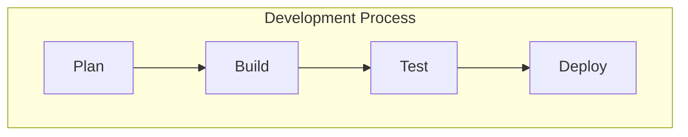

# Blog Builder

AI-powered blog content strategy and generation tool. Analyzes your website, understands your brand voice, discovers content gaps, and generates publication-ready articles for Medium and LinkedIn.

## Overview

Blog Builder automates the content creation pipeline:

```
┌─────────────────────────────────────────────────────────────────────────┐
│                         BLOG BUILDER PIPELINE                           │
├─────────────┬─────────────┬─────────────┬─────────────┬─────────────────┤
│   ANALYZE   │   DISCOVER  │    PLAN     │   GENERATE  │     OUTPUT      │
│   Website   │   Existing  │   Content   │   Article   │   Medium/LI     │
│   Content   │   Articles  │   Strategy  │   Drafts    │   Ready         │
└─────────────┴─────────────┴─────────────┴─────────────┴─────────────────┘
```

## Features

- **Site Analysis**: Extracts brand voice, key topics, value propositions, and target audience from any website
- **Blog Discovery**: Finds and analyzes existing blog content to understand current coverage
- **Gap Analysis**: Identifies missing topics, underserved keywords, and content opportunities
- **Content Planning**: Generates a strategic content calendar with article briefs
- **Article Generation**: Creates full-length, publication-ready articles in your brand voice
- **Multi-Platform Output**: Formats for Medium, LinkedIn, and standard Markdown
- **Mermaid Diagrams**: Auto-generates flowcharts, graphs, and visualizations in articles
- **Visual Theming**: Assigns gradient colors and patterns for hero images
- **Next.js Integration**: Generates `blog.ts` metadata file for direct use in Next.js projects

## Installation

```bash
# Clone the repository
git clone https://github.com/dbbuilder-org/blog-builder.git
cd blog-builder

# Install dependencies
npm install

# Set up environment
cp .env.example .env
# Add your ANTHROPIC_API_KEY to .env
```

## Usage

### Quick Start

```bash
# Analyze a site and generate blog plan
npx blog-builder analyze https://example.com

# Generate articles from existing plan
npx blog-builder generate https://example.com

# Full pipeline: analyze, plan, and generate
npx blog-builder run https://example.com
```

### Output Structure

```
~/.blog-builder/
└── example.com/
    ├── blog-plan.md           # Site analysis and content strategy
    ├── site-analysis.json     # Structured brand/site data
    ├── existing-articles.json # Discovered blog content
    ├── article-plan.json      # Planned articles with briefs
    └── output/
        ├── blog.ts            # Next.js-compatible metadata
        ├── README.md          # Integration instructions
        ├── article-1/
        │   ├── article.md     # Full article with Mermaid diagrams
        │   ├── medium.md      # Medium-optimized with hero image spec
        │   ├── linkedin.md    # LinkedIn-optimized (<3000 chars)
        │   └── metadata.json  # Article metadata
        └── article-2/
            └── ...
```

### Commands

| Command | Description |
|---------|-------------|
| `analyze <url>` | Analyze site and create blog-plan.md |
| `discover <url>` | Find existing blog articles |
| `plan <url>` | Generate content strategy and article briefs |
| `generate <url>` | Generate articles from plan |
| `run <url>` | Full pipeline (analyze → discover → plan → generate) |

### Options

```bash
--output, -o    Output directory (default: ~/.blog-builder/<domain>)
--count, -c     Number of articles to plan/generate (default: 10)
--topics, -t    Comma-separated topics to focus on
--audience, -a  Target audience description
--voice, -v     Brand voice override (professional, casual, technical, etc.)
```

## Configuration

### Environment Variables

```bash
ANTHROPIC_API_KEY=sk-ant-...     # Required: Claude API key
BLOG_BUILDER_OUTPUT=~/.blog-builder  # Optional: Output directory
```

### blog-builder.config.js (Optional)

```javascript
module.exports = {
  // Default number of articles to generate
  articleCount: 10,

  // Article length targets
  articleLength: {
    short: 800,    // LinkedIn posts
    medium: 1500,  // Standard blog posts
    long: 3000,    // In-depth guides
  },

  // Platform-specific settings
  platforms: {
    medium: {
      enabled: true,
      includeImages: true,
      includeTags: true,
    },
    linkedin: {
      enabled: true,
      maxLength: 3000,
      includeHashtags: true,
    },
  },
};
```

## blog-plan.md Structure

The generated blog plan includes:

```markdown
# Blog Strategy: [Site Name]

## Brand Analysis
- **Voice**: [Extracted brand voice characteristics]
- **Tone**: [Professional, casual, technical, etc.]
- **Key Topics**: [Main subject areas]
- **Value Propositions**: [Core offerings/benefits]
- **Target Audience**: [Identified audience segments]

## Content Inventory
- Existing articles: [count]
- Topics covered: [list]
- Content gaps: [identified opportunities]

## Recommended Articles
1. [Article Title]
   - Topic: [category]
   - Angle: [unique perspective]
   - Target: [audience segment]
   - Platform: [Medium/LinkedIn/Both]
   - Keywords: [SEO targets]

## Content Calendar
[Suggested publishing schedule]

## Style Guide
[Extracted writing guidelines for consistency]
```

## Platform-Specific Formatting

### Medium
- Hero image specification with gradient and pattern
- Proper heading hierarchy (H1 for title, H2 for sections)
- Mermaid diagrams as code blocks (renderable via mermaid.live)
- Pull quotes for key insights
- Tag suggestions based on content
- Recommended dimensions: 1200x630px

### LinkedIn
- Attention-grabbing hook in first line
- Under 3000 characters (critical for engagement)
- Shorter paragraphs (1-2 sentences)
- No Mermaid diagrams (not supported)
- Strategic use of bullet points
- 3-5 relevant hashtags
- Question or CTA to encourage engagement

### Mermaid Diagrams

Articles automatically include 3-6 Mermaid diagrams for:
- **flowchart**: Processes and decision trees
- **graph**: Relationships and comparisons
- **gantt**: Timelines and schedules
- **subgraph**: Grouped concepts

Example output:


## Visual Theming

Each article is assigned a visual theme for consistent hero images:

| Gradient | Use For |
|----------|---------|
| blue/indigo | Technical, engineering topics |
| green/teal | Growth, strategy, success |
| purple | Leadership, vision |
| orange/amber | Warnings, mistakes, learning |
| slate | Compliance, security |
| rose/cyan | Creative, design, UX |

Patterns: `dots`, `grid`, `waves`, `circuit`

## Next.js Integration

The generated `blog.ts` file can be copied directly to your Next.js project:

```bash
cp output/blog.ts your-nextjs-project/lib/blog.ts
```

It exports:
- `BlogPost` interface with full metadata
- `blogPosts` array of all articles
- `getBlogPost(slug)` - find single post
- `getAllBlogSlugs()` - for static paths
- `getBlogPostsByCategory(category)` - filter by category
- `getAllCategories()` - unique categories

## Architecture

```
blog-builder/
├── src/
│   ├── index.ts              # CLI entry point
│   ├── analyzer/
│   │   ├── site-analyzer.ts  # Main content extraction
│   │   ├── blog-discovery.ts # Find existing articles
│   │   └── brand-voice.ts    # Voice/tone analysis
│   ├── planner/
│   │   ├── gap-analysis.ts   # Content gap identification
│   │   ├── article-planner.ts # Generate article briefs
│   │   └── calendar.ts       # Content calendar generation
│   ├── generator/
│   │   ├── article-writer.ts # Main content generation
│   │   ├── medium-formatter.ts
│   │   └── linkedin-formatter.ts
│   └── utils/
│       ├── fetcher.ts        # URL fetching with retry
│       ├── markdown.ts       # Markdown utilities
│       └── storage.ts        # File system operations
├── templates/
│   ├── blog-plan.md          # Template for site analysis
│   └── article-brief.md      # Template for article briefs
└── tests/
```

## Contributing

1. Fork the repository
2. Create your feature branch (`git checkout -b feature/amazing-feature`)
3. Commit your changes (`git commit -m 'Add amazing feature'`)
4. Push to the branch (`git push origin feature/amazing-feature`)
5. Open a Pull Request

## License

MIT License - see LICENSE file for details.

## Author

Chris Therriault <chris@servicevision.net>
